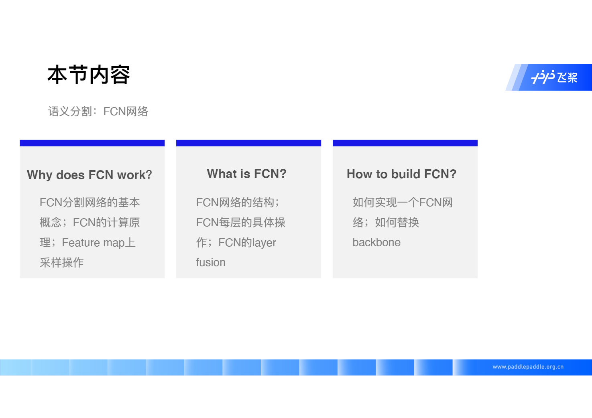
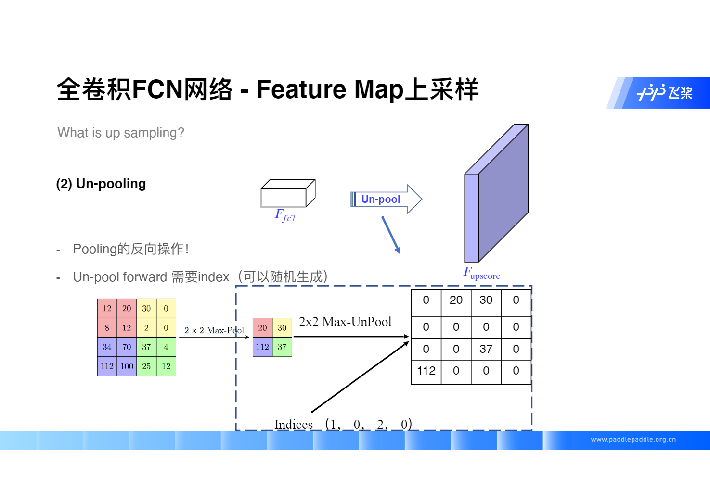

# FCN 全卷积网络详解


本节课内容



## Part 1 理论部分


本节课按照三部分进行：why、what 以及 how

- 为什么用 FCN
- 什么是 FCN 的结构
- 怎么使用/实现 FCN


区别 Fully Convolutional 以及 Fully Connected，这里 FCN 指只有卷积没有全连接

我们常见的用于图像分类的 CNN 网络如下：


图像分类 Vs 图像分割


那么全卷积如何做得呢？


简单的分类网络中，最后几层在 FCN 之前常用的架构是 全连接（Fully Connected）+ SoftMax 的结构，那么如果我们希望用 卷积（Conv）替代 全连接，该如何操作


注意：第一个 FC 层不能替换，代码后面演示会看到

但是前面解决了如何处理 FC 层，那么我们如何变大 encode 之后的 feature_map


这里我们主要关注三种上采样方案

- Up-sampling
- Transpose Conv
- Un-pooling

我们先看 Up-sampling

### Up-sampling


双线性插值，具体计算步骤如下


上述推导非常简单，实际上记住求线段上求两点之间某一点的坐标，可以表示为
$$
target\_point = \frac{l_2}{l_1 + l_2} P_1 + \frac{l_1}{l_1+l_2} P_2
$$
其中 $ P_1 $ 和 $ P_2 $ 分别代表线段上的两个点，$ l_1 $ 和 $ l_2 $ 分别表示 目标点 到 $ P_1 $ 和 $ P_2 $ 的距离

具体我们从实例中了解


```bash
vim interpolate.py
```

```python
# interpolate.py
import paddle.fluid as fluid
from paddle.fluid import ParamAttr
import numpy as np
np.set_printoptions(precision=2)

def main():
    with fluid.dygraph.guard(fluid.CPUPlace()):
        data  = np.array([
            [1,2],
            [3,4]
        ]).astype(np.float32)
        
        # reshape array to NxCxHxW
        data = data[np.newaxis, np.newaxis, :, :]
        
        data = fluid.dygraph.to_variable(data)
        
        out = fluid.layers.interpolate(data, out_shape=(4,4), align_corners=True)
        
        out = out.numpy()
        print(out.squeeze((0,1)))
        
        
if __name__ == "__main__":
    main()
```

关于代码中的 align_corner，我们参考这篇文章 [align_corners][]

执行代码结果如下


### Un-pooling



Pooling 时记录位置，上采样时将相应的像素放回对应的位置（现在用得较少）


### Transpose Conv


具体细节如下


老师在课上给予了推导过程


先 180° 转换，然后再 padding，最后卷积，得到目标输出

而卷积，在计算机内部，并不是通过滑动窗口来计算的，而是通过下图所示的矩阵乘法的操作


```bash
vim conv_transpose.py
```

```python
# conv_transpose.py
import numpy as np
import paddle.fluid as fluid
from paddle.fluid.dygraph import to_variable
from paddle.fluid import ParamAttr
np.set_precisions(precision=2)

def main():
    x = np.array([[1,2],
                  [3,4]])
    x = x.astype(np.float32)
    x = x[np.newaxis, np.newaxis, :, :]

    with fluid.dygraph.guard(fluid.CPUPlace()):
        x = to_variable(x)
        param_attr = ParamAttr(
            name='param',
            initializer=fluid.initializer.Constant(1.0)
        )
        conv_t = fluid.dygraph.Conv2DTranspose(num_channels=1,
                                                        num_filters=1,
                                                        filter_size=3,
                                                        param_attr=param_attr)
        out = conv_t(x)
        out = out.numpy()
        print(out.squeeze((0,1)))
    
if __name__ == '__main__':
    main()
```


## Part 2 实践部分


关于 FCN 中的 [AdaptiveAvgPool2d][]


[align_corners]: https://zhuanlan.zhihu.com/p/87572724	"一文看懂align_corners"

[AdaptiveAvgPool2d]: https://www.zhihu.com/question/282046628	"Pytorch 里 nn.AdaptiveAvgPool2d(output_size) 原理是什么?"

