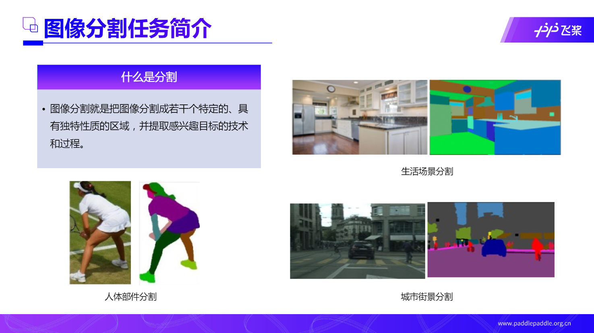
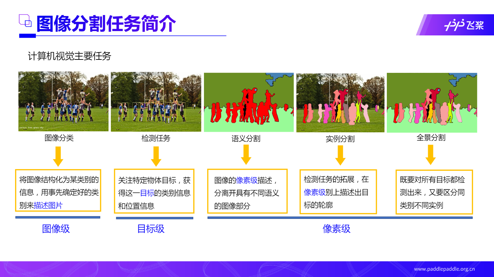
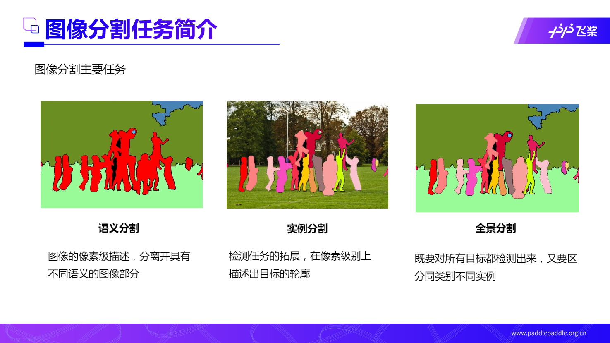

# Day1 图像分割算法：顶会冠军图像分割算法深度解密

## 01 图像分割任务简介

### 什么是分割

图像分割就是把图像分割成若干个特定的、具有独特性质的区域，并提取感兴趣目标的技术和过程。

### 计算机视觉主要任务

图像分类：将图像结构化为某类别的信息，用事先确定好的类别来描述图片（图像级）

检测任务：关注特定物体目标，获得这一目标的类别信息和位置信息（目标级）

语义分割：图像的像素级描述，分离开具有不同语义的图像部分（像素级）

实例分割：检测任务的拓展，在像素级别上描述出目标的轮廓（像素级）

全景分割：既要对所有目标都检测出来，又要区分同类别不同实例（像素级）

### 语义分割、实例分割、全景分割的区别

语义分割：图像的像素级描述，分离开具有不同语义的图像部分

实例分割：检测任务的拓展，在像素级别上描述出目标的轮廓

全景分割：既要对所有目标都检测出来，又要区分同类别不同实例

## 02 语义分割算法设计

### 语义分割网络概览

## 03 CVPR冠军方案解读

## 04 百度全新Transformer

